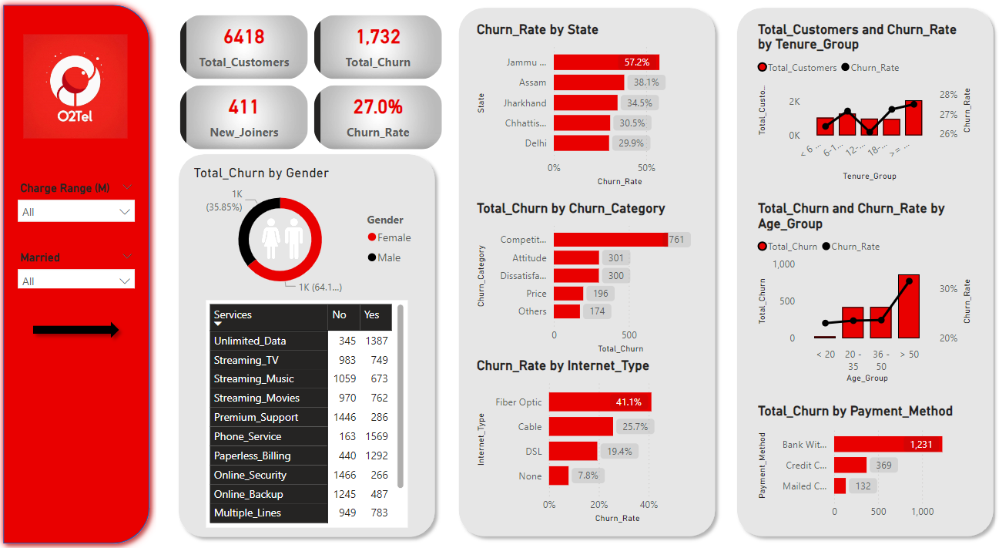
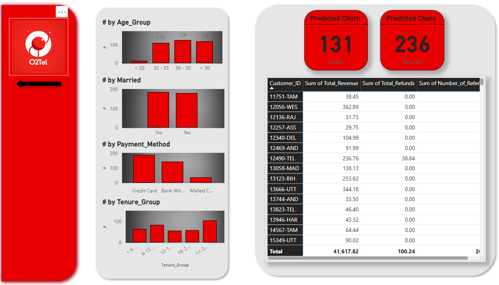

# O2Tel Customer Churn Analysis

## Project Overview

This project aims to analyze customer churn for a telecom company by leveraging data exploration, Power BI visualizations, and machine learning models. The primary goal is to identify customers who are likely to churn and the reasons behind their churn, providing insights to reduce churn rates and improve customer retention.

The project covers:
- **Data preprocessing and transformation** using SQL and Power BI.
- **Exploratory Data Analysis (EDA)** on customer demographics, services, and payment methods.
- **Predictive churn analysis** using machine learning models.
- **Interactive Power BI dashboard** for visual insights.

The methodology used here is applicable across various industries like telecom, retail, finance, and healthcare.

## Objectives

- Understand customer demographics, payment methods, and services.
- Identify customers at risk of churning based on historical data.
- Provide insights for improving customer retention through visualization and prediction.
- Predict future churn using machine learning models (Random Forest).
- Visualize the analysis and predictions using Power BI.

## Dataset

The dataset contains customer information, including demographics, services used, billing details, and customer status. The data is pre-processed to handle missing values and outliers.

Key columns in the dataset:
- **Customer Information:** `Customer_ID`, `Gender`, `Age`, `Married`, `State`, `Number_of_Referrals`
- **Service Information:** `Phone_Service`, `Multiple_Lines`, `Internet_Service`, `Internet_Type`, `Online_Security`, `Streaming_TV`, `Streaming_Music`, `Device_Protection_Plan`, `Unlimited_Data`
- **Billing Information:** `Contract`, `Paperless_Billing`, `Payment_Method`, `Monthly_Charge`, `Total_Charges`
- **Churn Details:** `Customer_Status`, `Churn_Category`, `Churn_Reason`

## Steps Involved

### 1. Data Preparation (SQL)
- Load the raw data into SQL Server staging area.
- Perform data exploration, handle missing values, and create new columns for further analysis.
- Create views in SQL for **active customers**, **churned customers**, and **new joiners**.

### 2. Power BI Dashboard
- Create calculated columns and measures in Power BI for metrics like **total churn**, **churn rate**, and **new joiners**.
- Design an interactive dashboard to visualize churn trends based on **demographics**, **services used**, and **payment methods**.
- Predict churn using a machine learning model and display the predictions.

#### Key Visuals:
- **Churn Rate by State**
- **Total Churn by Gender**
- **Churn by Payment Method**
- **Churn by Internet Type**
- **Churn by Tenure Group**

### 3. Machine Learning Model
- Use Python (Random Forest) to predict future churn based on customer data.
- Load the predicted churn data back into Power BI for visualization.

## Project Insights

- **Customers with long tenure** (greater than 24 months) are less likely to churn.
- **Bundled services** (like phone + internet) reduce churn rates.
- **High churn rates** observed in regions like **Karnataka** and **Tamil Nadu**, due to service issues.
- **Credit card payment** users are more prone to churn due to billing issues.
- **Younger customers** prefer feature-rich plans, whereas **older customers** value service reliability.

### Recommendations:
1. **Loyalty Programs**: Implement loyalty programs for customers with more than 24 months of tenure to reduce churn.
2. **Targeted Campaigns**: Offer bundled service packages to customers using a single service to increase retention.
3. **Service Improvements**: Focus on regions with high churn rates by improving network quality.
4. **Flexible Payment Options**: Introduce wallet or UPI payment methods to address billing-related churn.

## Technologies Used

- **SQL Server**: For ETL process and database management.
- **Python**: For building churn prediction models (Random Forest).
- **Power BI**: For data visualization and interactive dashboard creation.
- **Jupyter Notebooks**: For data analysis and machine learning model development.

## License

This project is licensed under the MIT License - see the [LICENSE](LICENSE) file for details.
